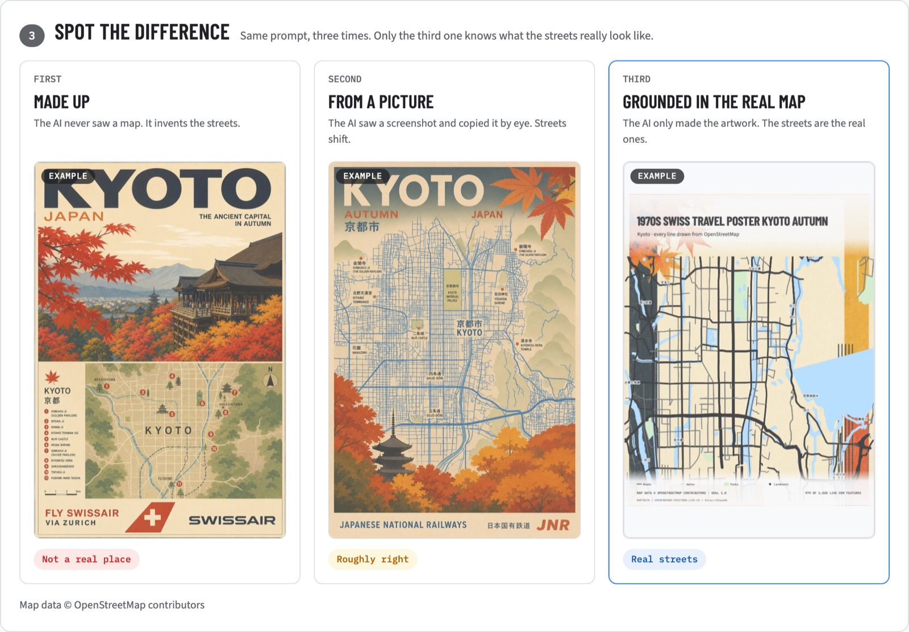

# MapTruth

[](https://github.com/rzrizaldy/map-truth/actions/workflows/ci.yml)

**A made-up map looks exactly like a real one.**

### → [map-truth.vercel.app](https://map-truth.vercel.app)

Ask any image model for a map of somewhere real and it invents the streets — confidently, beautifully, with a legend and emergency numbers. Fine for wall art. Dangerous for a protest route, an evacuation plan or a delivery zone.

MapTruth gives the model the actual place instead. Write a prompt; an agent finds it in OpenStreetMap, locks the real viewport, pins what you named at its true coordinates, and hands that over. Same prompt, both ways.



Both images came from *"Protest safety map — DPR Jakarta. Show gathering points and medical posts."*

- **Left, ungrounded.** Gathering points, medical posts, road closures, emergency numbers, an official-looking DPR RI seal. Every location in it is invented. Someone planning from it goes to the wrong places.
- **Right, grounded.** The real street layout around the parliament complex — and the legend is built from places that exist: Lapangan Panahan, Lapangan Tennis MPR Senayan, Taman Kridaloka, Posyandu RW 02, RSAL dr. Mintohardjo, Kimia Farma. Each sits at its true coordinate, under a source line anyone can check: `6.21021°S 106.80029°E · 1,151 OpenStreetMap shapes verified · Check on OpenStreetMap ↗`

MapTruth read the brief, decided it needed gathering points and medical posts, asked OpenStreetMap where those actually are near the parliament, and marked them on the map *before* handing it over. The model styled a real map instead of imagining one.

The dangerous one is the prettier one. That is the whole problem.

## Try it in 60 seconds

1. Open the site. Both cards already show a finished run — no waiting.
2. Edit the prompt to name any place — a city, a building, a landmark. A **Go to _that_** button appears; click it. The map flies there and locks.
3. Anything else the prompt names is looked up in OpenStreetMap, bounded to that viewport, and **pinned on the live map**. MapTruth also reads the brief for what it asks the map to *show* — gathering points, medical posts — and marks the real ones. All of it is on the map before capture, so it is inside the screenshot the model receives.
4. Hit **Run the agent on _that place_** to watch the WebMCP tool calls execute live, ending at a human approval gate.
5. Hit **Make 2 images** for your own run (~50s each, real `gpt-image-2` calls). Click any result for full screen, and follow its **Check on OpenStreetMap** link to confirm the coordinates.

## Why this is a WebMCP project

Agents are starting to browse and act on the web, and they will confidently produce spatial content that is wrong. WebMCP lets a page hand an agent real, typed tools instead of hoping it clicks the right pixels — so a site can supply verified ground truth instead of letting a model infer it from pixels.

MapTruth exposes ten tools:

`inspect_map_context` · `navigate_map` · `focus_place` · `lock_live_osm` · `verify_osm_lock` · `mark_from_osm` · `generate_comparison` · `inspect_comparison` · `verify_geography` · `export_artwork`

`mark_from_osm` is where the reasoning happens, and the split is deliberate: **the model decides what kind of thing a brief needs — gathering points, medical posts, transit — and OpenStreetMap decides where those things actually are.** The model picks from a closed vocabulary and never returns a coordinate, so it cannot smuggle an invented location past the lookup. The markers are drawn on the live map, which means they are inside the capture the image model receives.

The other one that matters is `focus_place`: an assistant grounds an image in "Jakarta", or in the DPR building, by *naming* it — and the page answers with a located, hashed, attributed map it can verify afterwards. `navigate_map` waits for the new viewport's tiles to settle before resolving, so an agent that immediately calls `lock_live_osm` gets real geometry rather than an empty source.

Every tool calls the same functions the buttons do. Mutating actions leave visible, selectable receipts; costed generation stops at a visible approval gate. With no WebMCP the page reports **Manual mode** and stays fully usable.

### Verify the WebMCP integration yourself

```bash
npm run verify:webmcp
```

Launches your installed Chrome with the WebMCP feature on (the command-line equivalent of `chrome://flags/#enable-webmcp-testing`), loads the **live production site**, and asks the browser's own `document.modelContext.getTools()` what the page registered. Nothing is mocked. Verified on Chrome 151:

```
ok    document.modelContext is exposed by the browser
ok    all 10 tools registered and discoverable
ok    every tool publishes an input schema
ok    every tool describes itself
ok    only the two inspect tools claim readOnlyHint
ok    the page reports "Agent mode · 10 tools"
```

**Watch an assistant do it** on the page runs those same functions in the open, for browsers without WebMCP — not a mock of the tools, the tools, with their real receipts and the same cost gate.

### Enabling agent mode

- **Challenge testing:** ChatGPT's in-app Browser supports WebMCP directly. In Chrome 149+, enable `chrome://flags/#enable-webmcp-testing` and relaunch.
- **Stock Chrome:** production is registered for the WebMCP origin trial. Its token is stored as the Vercel **build** environment variable `WEBMCP_ORIGIN_TRIAL_TOKEN`, and `vercel.ts` emits the `Origin-Trial` header. The current trial covers Chrome 149–156 and ends November 16, 2026; feature detection keeps Manual mode working when it is unavailable.

## The journey

One page, three steps:

1. **Say what you want** — write a prompt. Any place it names becomes a one-click button that flies the map there and locks it, so the prompt decides the geography instead of wherever you happened to pan. If the map ends up somewhere the prompt does not mention, the page says so.
2. **Pick the place** — drag anywhere and keep the view. The OSM vectors already loaded in MapLibre become hashed, traceable geometry in milliseconds, and the viewport resolves to a real place name.
3. **Spot the difference** — both routes run independently, keep partial success, and support per-route retry and cancellation.

Hashes, feature counts, Overpass re-verification and the tool receipts live in an "Under the hood" panel, out of the main flow. Old `/demo` and `/about` links land on the same page.

## Live OSM, no bundled dataset

MapTruth inspects the vector sources MapLibre already loaded via `querySourceFeatures` (falling back to `queryRenderedFeatures`) and normalizes roads, water, parks, and landmarks.

- Tile-derived IDs are `tile:<source-layer>:<source-id>:<geometry-hash>` and are never presented as canonical OSM IDs.
- Candidates outside the visible viewport are dropped, so the lock matches what you actually saw.
- When more features are in view than the cap allows, each class gets its own budget and features are ranked by importance (motorway before residential, named landmarks before unnamed). A single global cap used to starve roads behind parks.
- Locks record viewport, zoom, source revision, provenance, and geometry hashes. IndexedDB caches runtime locks by viewport and revision, keyed on a schema version so a stale entry can never be served.
- Map data © OpenStreetMap contributors under the ODbL, credited in the interface and in every export.

## API

Three Vercel Functions, all web-standard `POST` handlers:

- `POST /api/generate-route` — validates and runs exactly one `gpt-image-2` route.
- `POST /api/osm-extract` — canonical Overpass verification for a bounded bbox.
- `POST /api/plan-overlays` — reads the brief and returns overlay categories from a fixed enum. No coordinates, no queries.
- `POST /api/osm-overlays` — turns those categories into real, named OpenStreetMap places inside the locked bbox.
- `POST /api/geocode` — Nominatim lookup: forward (`{query}`), reverse (`{center}`), and viewport-bounded (`{query, within}`) so "DPR" resolves to the parliament building rather than a park of the same name elsewhere. English names, and a zoom clamped to a range the live lock accepts.

> Vercel treats a **default** export as the Node `(req, res)` signature and discards a returned `Response`. Named method exports (`export function POST`) are required for the Web handler shape — a default export makes every request hang until the function times out.

Set `OPENAI_API_KEY` server-side (never through a `VITE_` variable). On Vercel the endpoint can alternatively use the AI Gateway model ID `openai/gpt-image-2`.

```bash
npm install
npm run dev          # UI only
npm run dev:vercel   # UI + API (vercel dev)
```

## Verification

```bash
npm run lint && npm run typecheck && npm test && npm run build && npm run test:e2e
```

Unit tests cover tile classification, per-class budgeting and viewport clipping, stable locks, hash verification across both hashing paths, place extraction from prompt text (including acronym disambiguation and non-English map words), pin resolution, focus-zoom bounds, route-specific API validation, prompt safety, and deployment headers. Playwright covers prompt-driven map focus, truth pins at real coordinates, the checkable provenance line, the wrong-place warning, the one-page journey, legacy redirects, the live lock, repeat locking, WebMCP tool registration, the agent walkthrough, a full agent-only navigate → lock → inspect → verify run, the full-screen viewer, and mobile layout.

GitHub Actions runs lint, type-check, unit tests, build, and desktop/mobile Chromium on pushes and PRs to `main`; failures upload traces and screenshots. Vercel's Git integration deploys passing `main` revisions.

MapTruth verifies provenance against the OSM-derived geometry available to the current runtime. It does not claim OpenStreetMap is perfectly complete or current.
