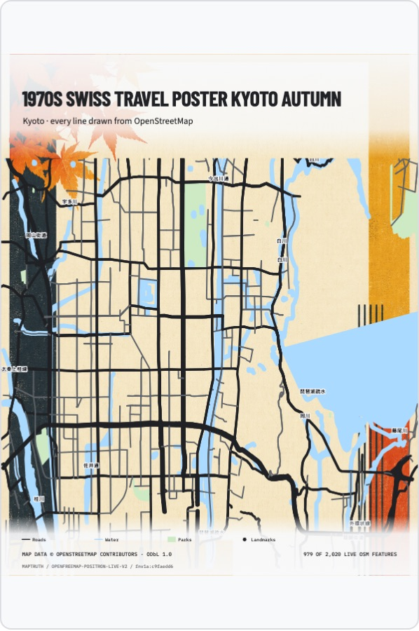

# MapTruth

[](https://github.com/rzrizaldy/map-truth/actions/workflows/ci.yml)

**Ask an AI for a map of somewhere real, and it invents the streets. MapTruth makes it stop.**

### → [map-truth.vercel.app](https://map-truth.vercel.app)

Type a prompt that names a place. MapTruth takes the map there, locks the OpenStreetMap geometry actually on screen, and renders your prompt three ways — so you can see exactly what grounding buys you.

| | What the AI was given | Result |
|---|---|---|
| **1 · Made up** | The prompt alone | A convincing city that does not exist |
| **2 · From a picture** | Prompt + a screenshot of the real map | Right shape, wrong streets |
| **3 · Grounded** | Prompt + a hashed OSM lock, and a ban on drawing geography | AI supplies the art; every line is real |



### Try it in 60 seconds

1. Open the site. The three cards already show a finished run — no waiting.
2. Edit the prompt to name any city. A **Go to _that place_** button appears; click it. The map flies there and locks.
3. Hit **Run the agent on _that place_** to watch the WebMCP tool calls execute live, ending at a human approval gate.
4. Hit **Make 3 images** for your own run (~50s per image, real `gpt-image-2` calls).
5. Drag the truth seam at the bottom: the streets line up exactly across the boundary, because they are the same geometry.

### Why this is a WebMCP project

WebMCP lets a page hand an agent real, typed tools instead of hoping it clicks the right pixels. MapTruth exposes nine, and the interesting one is `focus_place` — an assistant grounds an image in "Jakarta" by *naming* it, and the page answers with hashed geometry it can verify afterwards.

Production Chrome only exposes `document.modelContext` behind a flag or an origin trial, so **Watch an assistant do it** runs the very same functions in the open. Not a mock of the tools — the tools, with their real receipts and the same cost gate.

## The journey

The whole demo is one page, three steps:

1. **Say what you want** — write a prompt. Any place it names becomes a one-click button that flies the map there and locks it, so the prompt decides the geography instead of wherever you happened to pan. If the map ends up somewhere the prompt does not mention, the page says so.
2. **Pick the place** — drag anywhere and keep the view. The OSM vectors already loaded in MapLibre become hashed, traceable geometry in milliseconds, and the viewport resolves to a real place name.
3. **Spot the difference** — each route runs independently, keeps partial success, and supports per-route retry and cancellation. Then drag the truth seam: both halves share one heading, so only the map rendering changes and the streets line up exactly across the boundary.

Hashes, feature counts, Overpass re-verification and the tool receipts live in an "Under the hood" panel, out of the main flow. Old `/demo` and `/about` links land on the same page.

## Live OSM, no bundled dataset

MapTruth inspects the vector sources MapLibre already loaded via `querySourceFeatures` (falling back to `queryRenderedFeatures`) and normalizes roads, water, parks, and landmarks.

- Tile-derived IDs are `tile:<source-layer>:<source-id>:<geometry-hash>` and are never presented as canonical OSM IDs.
- Candidates outside the visible viewport are dropped, so the lock matches what you actually saw.
- When more features are in view than the cap allows, each class gets its own budget and features are ranked by importance (motorway before residential, named landmarks before unnamed). A single global cap used to starve roads behind parks.
- Locks record viewport, zoom, source revision, provenance, and geometry hashes. IndexedDB caches runtime locks by viewport and revision. Nothing is bundled at build time.
- Map data © OpenStreetMap contributors under the ODbL, credited in the interface and in every export.

## Agent-first WebMCP canvas

When `document.modelContext` exists, the page registers nine tools:

`inspect_map_context` · `navigate_map` · `focus_place` · `lock_live_osm` · `verify_osm_lock` · `generate_comparison` · `inspect_comparison` · `verify_geography` · `export_artwork`

`focus_place` takes a plain place name ("Jakarta") rather than the coordinates `navigate_map` wants, so an agent can ground generation in the place a prompt is actually about in one call.

Every tool calls the same functions the buttons do. Mutating actions leave visible, selectable receipts; affected features highlight on the map; costed generation stops at a visible approval gate. With no WebMCP the page reports **Manual mode** and stays fully usable.

`navigate_map` waits for the new viewport's tiles to settle before resolving, so an agent that immediately calls `lock_live_osm` gets real geometry rather than an empty source.

### Enabling agent mode

- **Locally / for testing:** Chrome with `chrome://flags/#enable-webmcp-testing` enabled, then relaunched.
- **In production:** a WebMCP origin trial token. Set `WEBMCP_ORIGIN_TRIAL_TOKEN` as a Vercel **build** environment variable; `vercel.ts` emits the `Origin-Trial` header only when it is configured. Without it, production Chrome reports Manual mode by design.

## API

Three Vercel Functions, all web-standard `POST` handlers:

- `POST /api/generate-route` — validates and runs exactly one `gpt-image-2` route.
- `POST /api/osm-extract` — canonical Overpass verification for a bounded bbox.
- `POST /api/geocode` — Nominatim lookup, forward (`{query}`) and reverse (`{center}`), in English. Results are floored to a zoom the live lock will accept, because a city's administrative bbox frames far wider than a lockable viewport.

> Vercel treats a **default** export as the Node `(req, res)` signature and discards a returned `Response`. Named method exports (`export function POST`) are required for the Web handler shape — a default export makes every request hang until the function times out.

Set `OPENAI_API_KEY` server-side (never through a `VITE_` variable). On Vercel the endpoint can alternatively use the AI Gateway model ID `openai/gpt-image-2`.

```bash
npm install
npm run dev          # UI only
npm run dev:vercel   # UI + API (vercel dev)
```

## Verification

```bash
npm run lint && npm run typecheck && npm test && npm run build && npm run test:e2e
```

Unit tests cover tile classification, per-class budgeting and viewport clipping, stable locks, hash verification across both hashing paths, place extraction from prompt text, focus-zoom bounds, route-specific API validation, prompt safety, unsafe text escaping, deployment headers, and export attribution. Playwright covers prompt-driven map focus, the wrong-place warning, the one-page journey, legacy redirects, the live lock, WebMCP tool registration, a full agent-only navigate → lock → inspect → verify run, attributed exports, and mobile layout.

GitHub Actions runs lint, type-check, unit tests, build, and desktop/mobile Chromium on pushes and PRs to `main`; failures upload traces and screenshots. Vercel's Git integration deploys passing `main` revisions.

MapTruth verifies provenance against the OSM-derived geometry available to the current runtime. It does not claim OpenStreetMap is perfectly complete or current.
